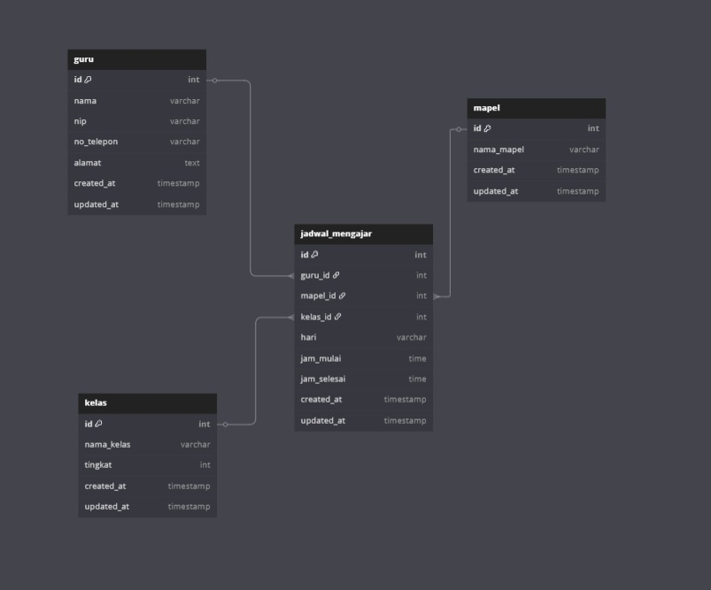

Defanda Yeremia - 20230801205

# Tema Data Guru

## Overview 

Sistem ini terdiri dari beberapa data utama yang saling terhubung, yaitu:

- **Guru**: Menyimpan data guru seperti nama, NIP, telepon, dan alamat.
- **Mapel**: Menyimpan daftar mata pelajaran yang diajarkan.
- **Kelas**: Menyimpan data kelas beserta tingkatannya.
- **Jadwal Mengajar**: Menyimpan jadwal guru mengajar, termasuk hari, jam, kelas, dan mapel yang diajarkan.

## Struktur Data & Relasi

### Entitas Utama:
1. **Guru**
2. **Mapel** (Mata Pelajaran)
3. **Kelas**
4. **Jadwal Mengajar** (Pivot Table antara Guru, Mapel, dan Kelas)

### Relasi:
- Satu guru dapat mengajar banyak kelas.
- Satu kelas memiliki beberapa guru dengan mapel berbeda.
- Jadwal mengajar menghubungkan guru, mapel, dan kelas dalam satu entitas waktu.
